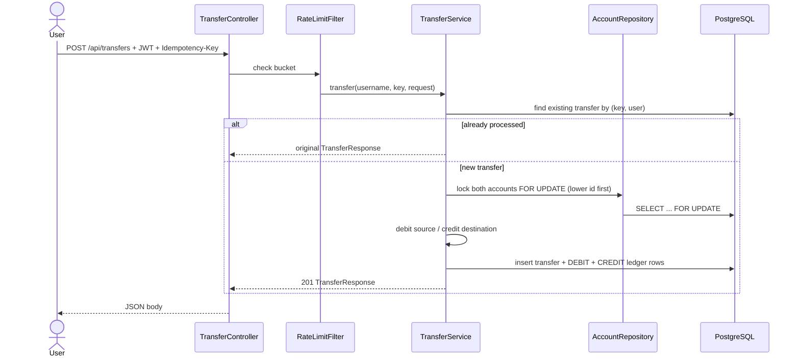
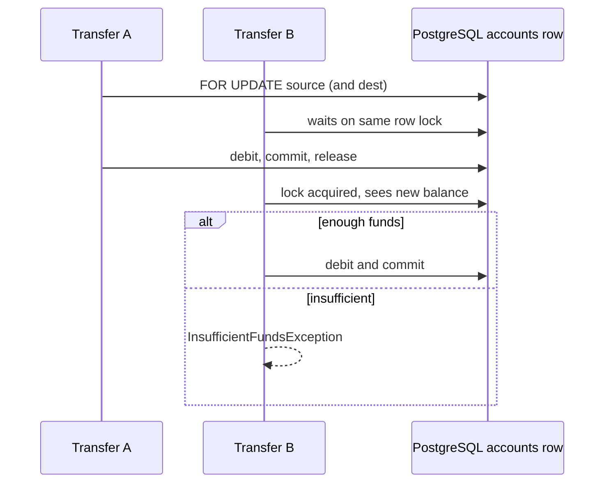
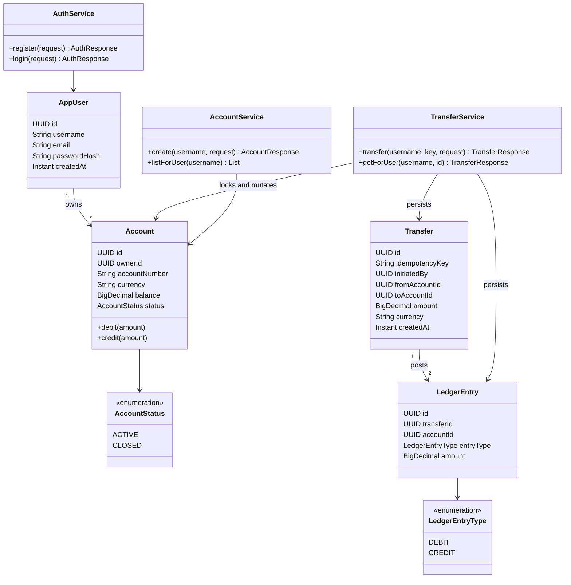
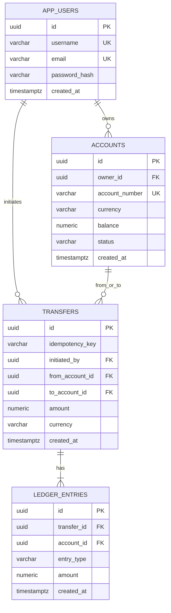

# UML

Sequence, class, and data model diagrams for **retail-banking-core**.

## Transfer sequence (happy path)

## Concurrent transfer (same source)

## Domain class diagram

## ER (Flyway V1)

